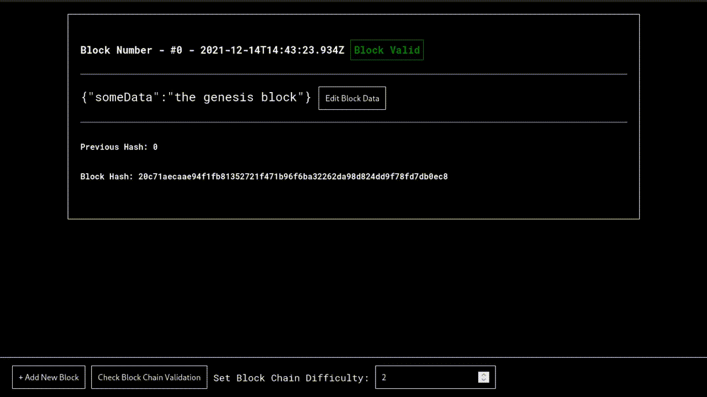

# React-blockchain
React-blockchainl tem o objetivo de implementar uma blockchain localmente. A
blockchain deve possibilita a modificação ̧ de seu conteúdo, a implementação de um
algoritmo de prova por trabalho com a possibilidade de alterar sua dificuldade
e uma função que verifica a integridade dos blocos.

# Implementação
Utilizou-se typescript e react para desenvolver um sistema web que possibilite a visualização 
da blockchain.
Para a gerção de hash, utilizou-se a biblioteca [crypto-js](https://www.npmjs.com/package/crypto-js), a qual implementa o
algoritmo SHA-256. Para implementar o hash, primeiramente implementou-se
uma estrutura de dados que contém um Bloco e uma Blockchain.
O bloco possui: o número do bloco, a data de crição, o hash do bloco, o
hash do bloco anterior , o nonce, um objeto onde se pode colocar um texto
no atribuito “someData”, e uma função que gera um novo hash para o bloco
levando em conta todos os dados do bloco. Já blockchain contém uma lista
de blocos e uma função que verifica a integridade da blockchain indicando se a
blockchain é inválida e desde qual bloco ela é inválida.
Além disso implementou-se uma rotina que minera um novo bloco de acordo
com uma dificuldade e os dados fornecidos pelo usuário para colocar no bloco. A
função procura um hash que comece com o número de zeros igual a dificuldade
escolhida pelo usuário.  É possível ver o tempo decorrido e algumas amostras de
hash sendo geradas em tempo real. Após o hash ser encontrado o usuário tem
a opcão de adicioná-lo a blockchain.

# Demonstração
[React-blockchain Live Demo](https://taiguz.github.io/react-blockchain/)